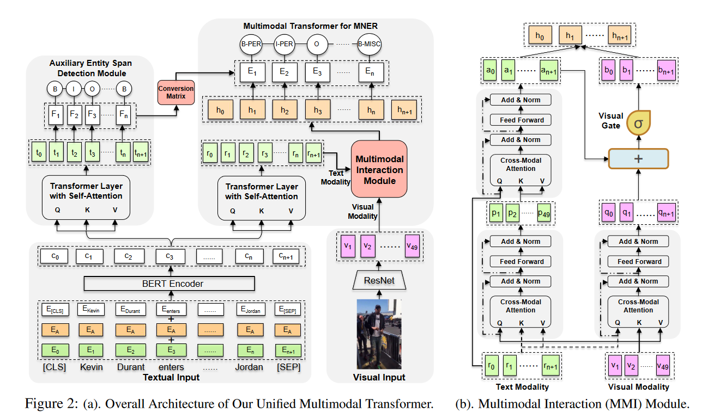

# paper info

paper name: Improving Multimodal Named Entity Recognition via Entity Span Detection with Unified Multimodal Transformer

author name: Jianfei Yu1, Jing Jiang2, Li Yang3, and Rui Xia1,∗

paper url: https://aclanthology.org/2020.acl-main.306/

code url: https://github.com/LiuPeiP-CS/IIE4MNER

doi: 10.18653/v1/2020.acl-main.306

# paper content

## main content

For Multimodal Named Entity Recongnition, they proposed a multimodal interation module to obtain both image-aware word representations and word-aware visual respresentations base on Transfor.

## drawbacks

1. Others attented word-aware visual representations, but ignore word respresentations under the visual context.
2. Ignoring the bais brought by the visual context.

## model

